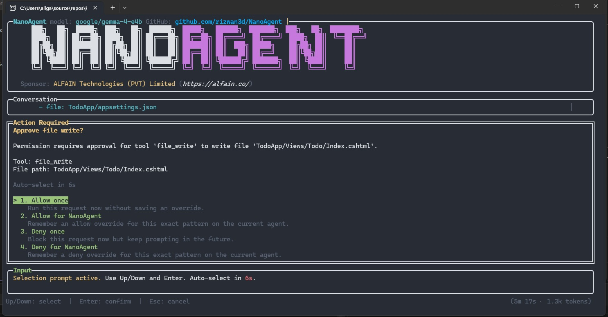

<p align="center">
  
</p>

<h1 align="center">NanoAgent</h1>

<p align="center">
  A local coding agent for desktop and terminal workflows
</p>

<p align="center">
  <a href="https://github.com/rizwan3d/NanoAgent/blob/main/LICENSE"></a>
  <a href="https://github.com/rizwan3d/NanoAgent"></a>
  <a href="https://github.com/rizwan3d/NanoAgent/stargazers"></a>
  <a href="https://github.com/rizwan3d/NanoAgent/issues"></a>
</p>

<p align="center">
  <a href="https://github.com/rizwan3d/NanoAgent/releases/latest/download/NanoAgent.Desktop-win-x64-setup.exe">
    
  </a>
</p>

---

## What is NanoAgent?

NanoAgent is a local coding agent that helps with day-to-day software engineering tasks from a desktop UI or terminal workflow. It can search and read files, apply focused patches, run build and test commands, manage model/provider configuration, and preserve local workspace sections.

---

## Features

- **Sandboxed Tool Calls** - Use read-only, workspace-write, or danger-full-access sandbox modes with shell escalation requests
- **Workspace Instructions** - Load persistent repo guidance from `AGENTS.md` or `.agent/AGENTS.md`
- **MCP Servers** - Load MCP servers from `agent-profile.json`
- **Lesson Memory** - Keep redacted workspace lessons for recurring mistakes, build failures, and fixes
- **File Operations** — Search, read, and edit files with full regex support
- **Shell Execution** — Run build/test commands directly from your terminal
- **Multi-Agent Profiles** — Switch between `build`, `plan`, and `review` profiles for different workflows
- **Thinking Effort** — Configure thinking effort: none, minimal, low, medium, high, or xhigh
- **Subagent Delegation** - Delegate focused tasks to built-in or workspace agents in `.nanoagent/agents`
- **Provider Flexibility** — OpenAI, Anthropic, Google AI Studio, or any OpenAI-compatible API
- **Desktop UI** — Use workspace sections, colorful tool output, and permission prompts in a native app
- **Session History** — Preserve conversation context across workspace sections
- **Local-First** — All your code stays on your machine

---

## Installation

### Desktop

Download the latest desktop app:
|    OS    |           |
|----------|-----------|
| Win x64  | [](https://github.com/rizwan3d/NanoAgent/releases/latest/download/NanoAgent.Desktop-win-x64-setup.exe) |
| Linux x64| [](https://github.com/rizwan3d/NanoAgent/releases/latest/download/NanoAgent.Desktop-linux-x64.zip) |
| Linux arm64| [](https://github.com/rizwan3d/NanoAgent/releases/latest/download/NanoAgent.Desktop-linux-arm64.zip) |
| Osx x64 | [](https://github.com/rizwan3d/NanoAgent/releases/latest/download/NanoAgent.Desktop-osx-x64.zip) |
| Osx arm64 | [](https://github.com/rizwan3d/NanoAgent/releases/latest/download/NanoAgent.Desktop-osx-arm64.zip) |

### macOS / Linux

```bash
curl -fsSL https://raw.githubusercontent.com/rizwan3d/NanoAgent/master/scripts/install.sh | bash
```

### Windows (PowerShell)

```powershell
irm https://raw.githubusercontent.com/rizwan3d/NanoAgent/master/scripts/install.ps1 | iex
```

Restart your shell after installation if the `nano` command is not immediately available.

---

## Quick Start

```bash
# Start the agent
nanoai
```

---

## Supported Providers

| Provider |
|----------|
| OpenAI |
| Anthropic |
| Google AI |
| Custom (OpenAI-compatible) |

---

## Usage

### Switch Profiles

| Command | Description |
|---------|-------------|
| `/profile build` | Switch to build profile |
| `/profile plan` | Switch to planning profile |
| `/profile review` | Switch to review profile |
| `/profile dotnet-expert` | Switch to a workspace custom profile |

### Delegate to Subagents

| Syntax | Description |
|--------|-------------|
| `@general` | Hand one turn to general-purpose subagent |
| `@explore` | Hand one turn to read-only explorer |
| `@code-reviewer` | Hand one turn to a workspace custom subagent |

### Custom Agents

Workspace custom agents live in `.nanoagent/agents/*.md`. The markdown body becomes the agent's system prompt, and optional front matter controls the profile:

```markdown
---
name: code-reviewer
mode: subagent
description: Read-only reviewer for bugs, regressions, edge cases, and missing tests.
editMode: readOnly
shellMode: safeInspectionOnly
tools:
  - directory_list
  - file_read
  - shell_command
  - text_search
---
Review the requested code or change set with a findings-first posture.
```

If front matter is omitted, the agent name is derived from the file name, the mode defaults to `subagent`, edits default to `readOnly`, and shell access defaults to `safeInspectionOnly`. Subagents can be invoked with `@agent-name` or through `agent_delegate`.

### Shell Commands

| Command | Description |
|---------|-------------|
| `/help` | List available commands |
| `/config` | Show current provider, model, profile |
| `/mcp` | Show configured MCP servers and discovered MCP tools |
| `/models` | Show available models |
| `/use <model>` | Switch active model |
| `/profile <name>` | Switch active profile |
| `/thinking` | Set thinking effort (none, minimal, low, medium, high, xhigh) |
| `/permissions` | Show permission summary |
| `/allow <tool>` | Allow a tool override |
| `/deny <tool>` | Deny a tool override |
| `/rules` | List effective permission rules |
| `/undo` | Roll back last file edit |
| `/redo` | Re-apply undone edit |
| `/exit` | Exit the shell |

### Tool Sandboxing

NanoAgent defaults to `WorkspaceWrite` sandbox mode for tool calls. Configure `Application:Permissions:SandboxMode` as `ReadOnly`, `WorkspaceWrite`, or `DangerFullAccess`.

Shell tool calls can request `sandbox_permissions: "require_escalated"` with a `justification`; escalation goes through the normal permission approval flow.

Permission shortcuts can be configured under `Application:Permissions`. They compile into the same rule stack shown by `/rules`, and explicit `Rules` entries still run last:

```json
{
  "Application": {
    "Permissions": {
      "file_read": "Allow",
      "file_write": "Ask",
      "file_delete": "Ask",
      "shell_default": "Ask",
      "shell_safe": "Allow",
      "network": "Ask",
      "memory_write": "Ask",
      "mcp_tools": "Ask",
      "shell": {
        "allow": {
          "commands": [
            "dotnet build",
            "dotnet test",
            "npm test",
            "pnpm test",
            "cargo test"
          ]
        },
        "deny": {
          "commands": [
            "rm -rf",
            "sudo",
            "curl | sh",
            "Invoke-WebRequest | iex"
          ]
        }
      }
    }
  }
}
```

### Lifecycle Hooks

Lifecycle hooks run local automation at key points in a turn. A hook receives a JSON payload on standard input and selected `NANOAGENT_*` environment variables such as `NANOAGENT_HOOK_EVENT`, `NANOAGENT_TOOL_NAME`, `NANOAGENT_PATH`, and `NANOAGENT_SHELL_EXIT_CODE`.

Before hooks block the action by default when the command exits non-zero. After hooks continue by default unless `continueOnError` is set to `false`.

```json
{
  "Application": {
    "Hooks": {
      "enabled": true,
      "defaultTimeoutSeconds": 30,
      "maxOutputCharacters": 12000,
      "rules": [
        {
          "name": "check-write",
          "events": ["before_file_write", "after_file_write"],
          "command": "scripts/check-write.ps1",
          "pathPatterns": ["src/**", "NanoAgent/**"]
        },
        {
          "name": "shell-failure",
          "event": "after_shell_failure",
          "command": "scripts/on-shell-failure.ps1",
          "shellCommandPatterns": ["dotnet test*", "npm test*"]
        },
        {
          "name": "task-complete",
          "event": "after_task_complete",
          "command": "scripts/after-task.ps1",
          "continueOnError": true
        }
      ]
    }
  }
}
```

Supported events include `before_task_start`, `after_task_complete`, `after_task_failed`, `before_tool_call`, `after_tool_call`, `after_tool_failure`, `on_permission_denied`, `before_file_read`, `after_file_read`, `before_file_write`, `after_file_write`, `before_file_delete`, `after_file_delete`, `before_file_search`, `after_file_search`, `before_shell_command`, `after_shell_command`, `after_shell_failure`, `before_web_request`, `after_web_request`, `before_memory_save`, `after_memory_save`, `before_memory_write`, `after_memory_write`, `before_agent_delegate`, and `after_agent_delegate`.

### Workspace Instructions

NanoAgent automatically loads `AGENTS.md` and `.agent/AGENTS.md` from the workspace root and adds them to the model's system prompt as persistent project instructions.

### Lesson Memory

NanoAgent stores reusable workspace lessons in `.nanoagent/memory/lessons.jsonl` and automatically retrieves relevant lessons for future turns. Search and list operations are automatic. Automatic failure observations are enabled and redacted by default. Manual lesson writes (`save`, `edit`, `delete`) require user approval unless memory policy is changed.

Workspace memory and audit policy lives in `.nanoagent/agent-profile.json`:

```json
{
  "memory": {
    "requireApprovalForWrites": true,
    "allowAutoFailureObservation": true,
    "allowAutoManualLessons": false,
    "redactSecrets": true,
    "maxEntries": 500,
    "maxPromptChars": 12000,
    "disabled": false
  },
  "toolAudit": {
    "enabled": false,
    "redactSecrets": true,
    "maxArgumentsChars": 12000,
    "maxResultChars": 12000
  }
}
```

When `toolAudit.enabled` is true, every completed tool call appends one local JSONL record to `.nanoagent/logs/tool-audit.jsonl`. The audit log is disabled by default.

### Secret Redaction

NanoAgent redacts common secrets before storing or displaying tool output, lesson memory, audit records, logs, conversation history, session state, workspace instructions, and error text. Covered patterns include OpenAI-style `sk-...` keys, GitHub `ghp_...` and `github_pat_...` tokens, Google `AIza...` keys, bearer tokens, secret-looking key/value assignments such as `password=`, `api_key=`, and `access_token=`, `.env` assignment values, and private key blocks.

### MCP Servers

NanoAgent can connect to MCP servers configured in `agent-profile.json`. It reads the user-level NanoAgent `agent-profile.json` shown by `/config` and the workspace-local `.nanoagent/agent-profile.json`, then exposes server tools to the model as `mcp__server__tool`.

```json
{
  "mcpServers": {
    "context7": {
      "command": "npx",
      "args": ["-y", "@upstash/context7-mcp"],
      "startupTimeoutSeconds": 20,
      "toolTimeoutSeconds": 45,
      "defaultToolsApprovalMode": "prompt",
      "env": {
        "MY_ENV_VAR": "MY_ENV_VALUE"
      }
    }
  }
}
```

Supported transports are stdio (`command`, `args`, `env`, `envVars`, `cwd`) and basic streamable HTTP (`url`, `bearerTokenEnvVar`, `httpHeaders`, `envHttpHeaders`). Use `enabledTools` or `disabledTools` to filter server tools, and `/mcp` to inspect what loaded.

---

## Examples

### Fix a Bug

```
$ nanoai
> Find and fix the memory leak in src/cache.c
```

### Explore Codebase

```
$ nanoai
> @explore How does authentication work in this project?
```

### Review Changes

```
$ nanoai
/profile review
> Review the changes in this branch for security issues
```

---

## License

Apache License 2.0 — See [LICENSE](LICENSE) for details.

---

<p align="center">
  Sponsored by  <br /> <a href="https://alfain.co/"></a>
</p>
